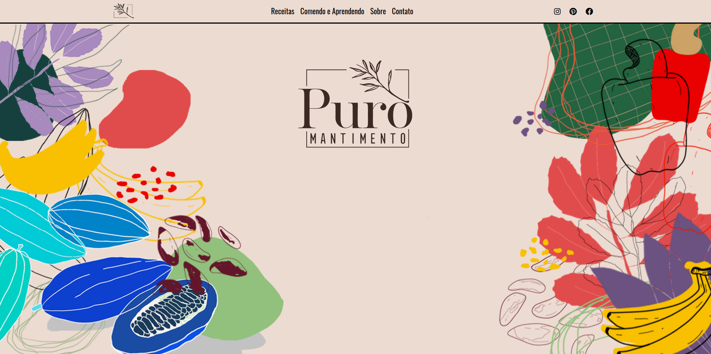

# [Puro Mantimento](https://puromantimento.com)

## Description

Blog of Recipe by Larissa Bordalo

## Dependences

[jekyll-sass-converter](https://github.com/jekyll/jekyll-sass-converter)

[jekyll-coffeescript](https://github.com/jekyll/jekyll-coffeescript)

[jekyll-sitemap](https://github.com/jekyll/jekyll-sitemap)

[jekyll-paginate](https://github.com/jekyll/jekyll-paginate)

[jekyll-seo-tag](https://github.com/jekyll/jekyll-seo-tag)

[jemoji](https://github.com/jekyll/jemoji)

## License

(The MIT License)

Copyright (c) 2020 Filipe Crespo
